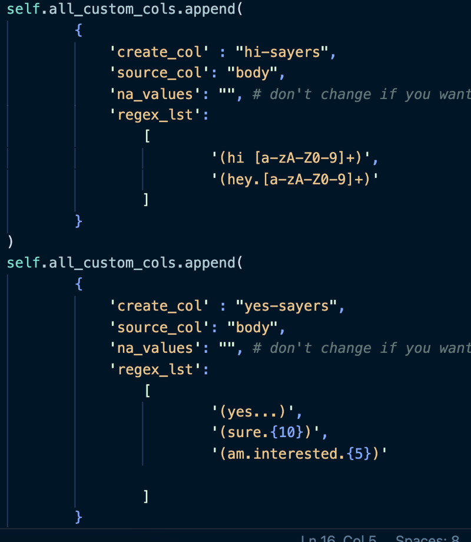
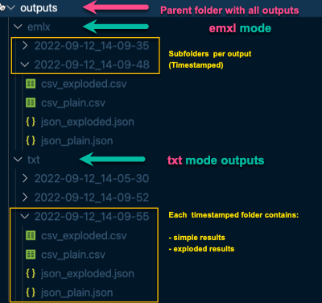

# Mac OS Mail - Email Extractor 
## Mail App Emails to CSV or JSON

**What it (currently) does:**

Email Export from Apple's Mail App on Mac OS -> Plaintext input -> Parse/Extract -> Save to CSV or JSON

*Sometimes it can be handy to get structured data from a mailbox on Mac OS (Mail). This is a quick (still) hacky script which parses a plaintext export email export from the Mail app in Mac OS and returns a structured CSV.*

## Features
- **TXT mode**: Parse manually exported emails from a txt file.
- **EMXL mode**: Parse emlx files created by the Mail app
- Export formats & versions per script execution
  - Export versions
    - "plain"
    - "exploded": email addresses are split in case of multiple email recipients, each row contains only one receiving address (all other fields are duplicated)
  - Formats (for each version)
    - CSV
    - JSON
- Custom Columns based on Regex-extraction:
  - Custom regex extraction schemes can be defined in `config.py`:
    

## Input (text file mode)
1. Select the emails you want to parse in Mac OS Mail (hold shift in order to select multiple, CMD + A in order to select all from the current mailbox)
2. File > Save As > Select Format: Plain Text > Save to the script directory & rename to "input.txt"

## Input (emlx parser mode)
Edit the config.py file with your Mac OS filepath to your Mailbox that you want to extract email data from

## Run
> Tested with Python 3.10.6

```
pip install -r requirements.txt
```
1. edit config.py
2. run either in **txt file mode:**


```
rename your txt file input.txt, place in script dir, then execute:
python3 extract_txt.py
```

or 
1. run in emlx parser mode:

```
don't forget to edit config.py first, then execute:
python3 extract_txt.py
```

if you want to use a CLI with args 
(implementation in progress)

```
python3 mac-os-extract-mails.py

[Options]
-e : run emlx parser
-t : run txt file parser
-c : open config file for editing
-sinput: select input file for txt file parser
-sodir: select folder for outputs
```

## Outputs


## Output Columns

```

- "date_utc"
- "date_iso"
- "date"
- "from"
- "from_name"
- "from_mail"
- "subject"
- "to"
- "to_name"
- "to_mail"
- "from"
- "reply_to"
- "reply_to_name"
- "reply_to_mail"
- "body"
- "x-universally-unique-identifier"
- "message-id"
- "mime-version"
- "content-type"

```

## Todo

- [x] Plaintext mode
- [x] Emlx mode
- [x] Explode outputs: Split multiple recipient email addresses into separate data rows (1 email = 1..* rows). Currently: 1 row = 1 email, recipient email addresses are comma-separated
- [x] Custom columns from RegEx outputs
- [x] Export json
- [ ] Command line tool
- [ ] EMXL mode: Add caching
- [ ] EMXL mode: Add mailbox folder picker (tkinter?)
- [ ] TXT mode: Add file picker for input file (+cli path option)
- [ ] Option: Create Google Sheet from Outputs
- [ ] Option: Setting utc min-date
- [ ] Option: Ignore Signatures
- [ ] Option: Traverse all mbox'es if a mail box for mail account folder is undefined
